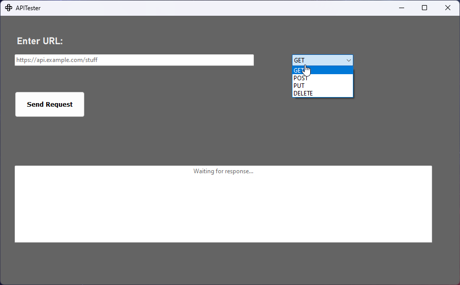

# ApiTester
(Very) simple API-Tester written in **C#** with **.NET 6.0**

Written because I wanted to experiment with WinForms 🔧.

Has basic Async/Await 🕑 capabilities, but nothing special.

Code is not the best, but that wasn't the point of this Project.
## Screenshot

  

